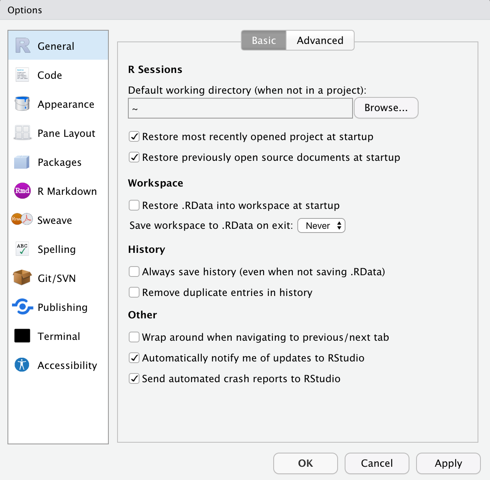
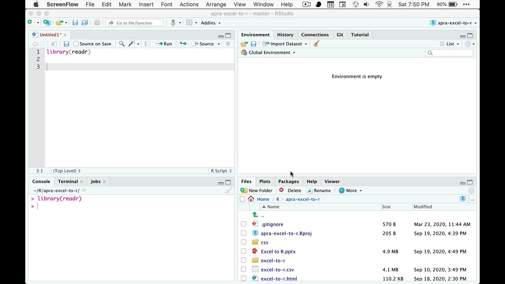
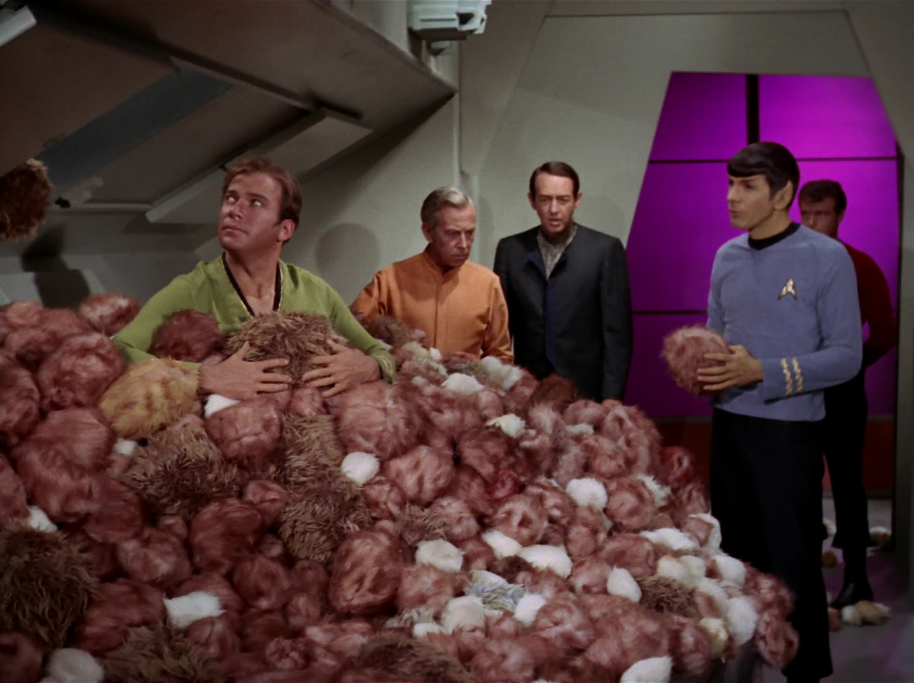

```{r setup, include=FALSE}
knitr::opts_chunk$set(echo = TRUE)
library(tidyverse)
library(learnr)
library(kableExtra)
library(here)
library(scales)

df <- read_csv(
  "excel-to-r.csv",
  col_types = cols(
    `most recent gift amount` = col_number(),
    `most recent gift date` = col_date(format = "%m/%d/%y"),
    `lifetime giving` = col_number()
  )
)
rating_values <- tibble(rating = c("Less than $10K",
                                   "$10K-$24K",
                                   "$25K-$49K",
                                   "$50K-$99K",
                                   "$100K-$249K",
                                   "$250K-$999K",
                                   "$1M-$2.49M",
                                   "$2.5M-$4.99M",
                                   "$5M-$9.99M",
                                   "$10M+"),
                        rating_value = c(1,
                                         10000,
                                         25000,
                                         50000,
                                         100000,
                                         250000,
                                         1000000,
                                         2500000,
                                         5000000,
                                         10000000))
```

## I Can't Do This!

```{r, img-mountain1, echo=FALSE, out.width="100%", fig.align="center", fig.cap="photo by [Toomas Tartes](https://unsplash.com/@toomastartes) on [Unsplash](https://unsplash.com/photos/Yizrl9N_eDA)"}

```

Getting started with R can feel like standing in front of a mountain with no idea how you could possibly climb it, especially if you're new to programming.

> I couldn't get R to do anything. It wouldn't read in files, draw a plot or multiply two numbers together. All I could do was generate mystifying errors and get mocked on Stack Overflow for asking redundant questions. This was all made more frustrating by the fact that I could accomplish all of these things in Excel without much difficulty.

[*Gordon Shotwell's blog post: Excel to R*](https://blog.shotwell.ca/posts/r_for_excel_users/)

The last sentence of that quote embodies how I felt during the first year or two of trying to teach myself R. If you decide to embark on the journey of learning R, try keeping the mountain metaphor in mind and remember to occasionally stop looking *up* the mountain and instead look *back* at how far you've come.

```{r, img-mountain2, echo=FALSE, out.width="100%", fig.align="center", fig.cap="photo by [Peter Conlan](https://unsplash.com/@peterconlan) on [Unsplash](https://unsplash.com/photos/LEgwEaBVGMo)"}

```

### Before We Start

Unfortunately there's only so much that we can cover in this short workshop. If you do have questions after you leave, please don't hesitate to get in touch. I've also included a number of resources at the end that can help get you started.

Let's get started!

## Getting Started

For this workshop, you won't need to install any software on your own machine; everything will be provided for you here in this document. If you are interested in trying this out on your own, the download links for R, RStudio and the code from today's session are below.

#### [R](https://cran.r-project.org)

#### [RStudio](https://rstudio.com)

#### [Excel to R Code](https://github.com/mattfarrow1/apra-excel-to-r/blob/master/workshop-code.R)

### First Steps

1.  Install R
2.  Install RStudio
3.  Open RStudio
4.  Navigate to the **Tools** menu, **Global Options**
5.  Change "Save workspace to .RData on exit:" to *Never*
6.  Click [OK]

```{r set-options, echo=FALSE, out.width="50%", fig.align="center", fig.cap="RStudio Options"}

```

Finally, make sure you have a new script window open. If you don't, you can navigate to **File** \> **New File** \> **R Script**.

### Installing Packages

At this point, we could move forward using what is referred to as "Base R" - the language that you downloaded from CRAN. The programming syntax for base R can be quite challenging however, so we're going to install a set of packages that will make our work cleaner and more straightforward. These packages are part of what is called the [tidyverse](https://www.tidyverse.org) and is described on its website as:

> The tidyverse is an opinionated collection of R packages designed for data science. All packages share an underlying design philosophy, grammar, and data structures.

To install packages, we use the `install.packages("package_name")` format. Don't forget the quotation marks around the name of the package!

```{r install-packages, eval=FALSE, warning=FALSE, excercise = TRUE}
# Install "tidyverse" packages
install.packages("tidyverse")

# Once the packages are installed, we need to tell R that you want to use them.

# Load tidyverse packages
library(tidyverse)
```

The reason we don't need quotation marks around `tidyverse` in the library function is because, in this case, RStudio can already see that a package called tidyverse exists in the library.

### Conventions to Know

Coming from Excel, certain conventions are fairly commonplace, things like parenthases `()` to enclose terms in a formula, mathematical operators like `+`, `-`, `/`, and `*`. `R` has some of its own quirks that can be difficult to wrap your head around. I've included a small list of conventions that may be helpful as you're getting started.

| R        | Description                              | Shortcut         |
|----------|------------------------------------------|------------------|
| \#       | Comment out a line (don't run this)      |                  |
| \<-      | The assignment operator                  | Alt + -          |
| %\>%     | The pipe function                        | Ctrl + Shift + M |
| \$       | Pick a specific column from a data set   |                  |
| ==       | Comparison operator (x equals y)         |                  |
| !=       | Comparison operator (x does not equal y) |                  |
| is.na()  | Blank cells                              |                  |
| !is.na() | Not blank cells                          |                  |

Two other things that might be helpful:

1.  To reset things and start over in R, you can use the [Session] [Restart R] command, or use the `Ctrl + Shift + F10` keyboard shortcut.
2.  Projects allow you to collect all of the data and code that you use for a project into a single location.

### Read the Data

In Excel, we open up a data set and then immediately start working. R has a level of abstraction in that we don't actually modify the original Excel file. A simple view of the workflow is:

-   Point R at the location of a file
-   R loads the data of the file into memory
-   All work takes place on the version in memory, leaving the original alone
-   If you make a change, a mistake, or want to start over, the original data is ready
-   Finally, you can save your work back into an Excel-readable file

We're going to start at the beginning and read in our data set. This can be done in code, but there's a more user-friendly way to it. We're going to use the `read_csv` function that comes as part of the `readr` package in the `tidyverse`. There are packages, `readxl` for example, that will let you read .xlsx files, but today we're just going to work with a simple .csv file.

```{r readr-import, echo=FALSE, out.width="100%", fig.align="center", fig.cap="Import Data Set with readr"}

```

```{r load-data, eval=FALSE}
df <- read_csv(
  "excel-to-r.csv",
  col_types = cols(
    `most recent gift amount` = col_number(),
    `most recent gift date` = col_date(format = "%m/%d/%y"),
    `lifetime giving` = col_number()
  )
)
```

One of the things you're probably starting to realize is that `R` requires you to type *everything*. There aren't any buttons that generate charts or format your columns. This is part of your journey up the mountain. It may be new, it may be weird, and it may be uncomfortable, but keep going and eventually you may not ever want to go back to Excel.

### Cleaning up Column Names

Here's something that you don't need to do, but will make your life much easier. Let's look at our current column names:

```{r column-names}
colnames(df)
```

You'll notice that a couple of the column names have words separated by an underscore, while others have spaces. We're going to make all of the variable names have underscores instead of spaces. The reason we're doing that is it makes it much easier for R to know that "most recent gift amount" is not four separate things, but a single variable: most\_recent\_gift\_amount. I could have done this ahead of time, but most of you will probably be working with Excel files that have column names like "Research Rating" or "Lookup ID" and may find this helpful.

We're going to use a function from the `janitor` package to reformat out column names with underscores instead of spaces.

```{r img-janitor, echo=FALSE, out.width="75%", fig.align="center"}
knitr::include_graphics("images/janitor_clean_names.png")
```

```{r clean-df}
df <- janitor::clean_names(df)
```

```{r df-janitor, exercise = TRUE, exercise.setup = "clean-df"}
# install.packages("janitor")

# Clean my column names
df <- janitor::clean_names(df)

# Look at the cleaned up column names
colnames(df)
```

You may have noticed there that I used a slightly different format, `janitor::clean_names(df)`, calling the library name, followed by two colons, followed by the function name. Since that's the only time in this workshop that I'm using the `janitor` package, this was a way, assuming the package is already installed, to call the one function without loading the whole library.

You may have also noticed that the function defaults to camel\_case, which is my preferred style, but there are many others!

```{r img-naming, echo=FALSE, out.width="75%", fig.align="center"}
knitr::include_graphics("images/coding_cases.png")
```

### Examining the Data

There are a number of ways to take a look at your data at this point. The first is to click on the name of the data set in the Environment tab. Here are two other ways from within the code.

```{r examine-data, exercise = TRUE, exercise.setup = "clean-df"}
# Structure: this is a built-in function of R
str(df)

# Glimpse: a more compact version of str that comes with the tidyverse
glimpse(df)
```

Now that we've seen how to load and look at our data, let's look at manipulating it and getting it ready for analysis.

## Data Manipulation

### The `dplyr` Package

```{r img-dplyr, echo=FALSE, out.width="75%", fig.align="center"}
knitr::include_graphics("images/dplyr_wrangling.png")
```

The [`dplyr`](https://dplyr.tidyverse.org) package provides a "consistent set of verbs that help you solve the most common data manipulation challenges."

-   `mutate()` adds new variables that are functions of existing variables
-   `select()` picks variables based on their names
-   `filter()` picks cases based on their values
-   `summarise()` reduces multiple values down to a single summary
-   `arrange()` changes the ordering of the rows.

`dplyr` has been my workhorse package for almost all of the work that I used to do in Excel, at least in terms of data manipulation. We'll start with `filter()`.

### Filtering Data

```{r img-filter, echo=FALSE, out.width="100%", fig.align="center"}
knitr::include_graphics("images/dplyr_filter.jpg")
```

We're approaching this session from the perspective of doing prospecting in Excel. We've started with a data set from our CRM and we're going to append some additional data, create some new columns, and filter the data to create a list of potential prospects for our gift officer.

Let's jump right in to seeing some results. In [Excel](https://support.microsoft.com/en-us/office/filter-data-in-a-range-or-table-01832226-31b5-4568-8806-38c37dcc180e), filtering data is a quick way to sift through the data to find new prospects and answer questions such as:

-   Who recently made a gift?
-   Who is rated at a certain threshold?
-   Who lives in the city I'm visiting?

However, one of the challenges in using Excel for this work is that it isn't reproducible. Let's say you apply a series of filters to answer all three of these questions, but then clear the selection when another idea strikes. Do you remember the sequence of filters you applied to get back there? What if your fundraiser comes to you and asks, "Why was this prospect added to my portfolio?" Can you answer them?

In R, We're going to start by chaining some pieces together using the `%>%` command. In tidyverse parlance, this is referred to as a "pipe," and it is used to pipe or chain actions together.

```{r example-filter-1, exercise = TRUE, exercise.setup = "clean-df"}
# Find prospects whose most recent gift was on or after 6/1/2019
df %>%
  filter(most_recent_gift_date >= "2019-06-01")
```

Here we took our data **(df)** and piped it **(%\>%)** to our filter where we asked it to return prospects whose most recent gift date was greater than or equal to the start of our fiscal year, June 1, 2019 **(filter(most\_recent\_gift\_date \>= "2019-06-01"))**.

We can also filter more than one thing at a time:

```{r example-filter-2, exercise = TRUE, exercise.setup = "clean-df"}
# Find prospects whose most recent gift was on or after 6/1/2019 and who live in Texas
df %>%
  filter(most_recent_gift_date >= "2019-06-01",
         st == "TX")
```

In this example, we've added a comma after 6/1/2019 along with a 2nd filter - **state equals Texas** - to our last example. If, for some reason, we wanted to see recent givers *or* prospects who lived in Texas, we could do that too:

```{r example-filter-3, exercise = TRUE, exercise.setup = "clean-df"}
# Find prospects whose most recent gift was on or after 6/1/2019 OR who live in Texas
df %>%
  filter(most_recent_gift_date >= "2019-06-01" |
           st == "TX")
```

In that case, we used the vertical line `|` instead of a comma `,` to define the `or` command.

### Joining Data

Now that we've seen the basics of filtering, let's look at our ratings. What values do we have in this data set?

The `unique` function returns all of the different values within the specific field(s). In this case, we've put `df$rating` inside the parentheses. That tells R that we want the unique values of the rating column inside the `df` data set.

```{r example-unique, exercise = TRUE, exercise.setup = "clean-df"}
unique(df$rating)
```

In the console, you can see the list of ratings there. Let's look at who our \$10M+ rated folks are, using the filtering skills we learned in the previous section.

1.  Take the df data frame
2.  Then pipe or send it to the filter command
3.  Where we want to find ratings that equal (note: ==) \$10M+
4.  Display the results in the console

```{r example-filter-4, exercise = TRUE, fig.cap="If only our own CRMs had so many prospects rated $10M+!"}
df %>% 
  filter(rating == "$10M+")
```

While that's certainly useful, it would be easier if we could enter a numerical value for rating instead of writing out the actual rating each time. In Excel, you might have used a VLOOKUP function to accomplish that task. In R, we'll use a join.

#### VLOOKUP (Excel) vs. Join (R)

We start by creating a reference table and recreating the VLOOKUP functionality that you know from Excel. In R, you may see these referred to as data frames or tibbles. A tibble is simply the name for a tidyverse-styled data frame.

```{r img-tribble, echo=FALSE, out.width="30%", fig.align="center", fig.cap="Not a Tibble"}

```

The structure of a tibble is: tibble(column\_1\_name = c(val1, val2, etc.), column\_2\_name = c(val1, val2, etc.), column\_3\_name = c(val1, val2, etc.))

Visually, it would look like this:

| column\_1\_name | column\_2\_name | column\_3\_name |
|-----------------|-----------------|-----------------|
| val1            | val1            | val1            |
| val2            | val2            | val2            |
| val3            | val3            | val3            |

Our tibble will be called `rating_values` and will contain two columns of data: a list of the ratings as they appear in the CRM, along with a column that contains a corresponding numerical value to that rating.

```{r rating-tibble, exercise = TRUE}
rating_values <- tibble(rating = c("Less than $10K",
                                   "$10K-$24K",
                                   "$25K-$49K",
                                   "$50K-$99K",
                                   "$100K-$249K",
                                   "$250K-$999K",
                                   "$1M-$2.49M",
                                   "$2.5M-$4.99M",
                                   "$5M-$9.99M",
                                   "$10M+"),
                        rating_value = c(1,
                                         10000,
                                         25000,
                                         50000,
                                         100000,
                                         250000,
                                         1000000,
                                         2500000,
                                         5000000,
                                         10000000))

# Print results
rating_values
```

You may notice that rating\_value is in scientific notation. If that bothers you, here's how to turn it off.

```{r rating-tibble-2, exercise = TRUE}
options(scipen = 50)  # any significantly high number will work, I tend to use 50

# Print results again
rating_values
```

That's much better. You may have noticed I used the same variable name `rating` on this new data set as we have in `df`. That was intentional. When joining two data sets together, having identical column names makes matching much easier.

```{r left-join, exercise = TRUE}
# Join together df & rating_values
prospecting <- left_join(df, rating_values)

# If you have lookup column names that don't match:
# prospecting <- left_join(df, rating_values, by = c("df_id_column" = "rating_values_id_column"))

# Look at the newly merged data
prospecting
```

```{r clean-prospecting}
df <- janitor::clean_names(df)
prospecting <- left_join(df, rating_values)
options(scipen = 50)
```

### Mutating Data

We'll use the `mutate()` function to take our new rating values and create a new variable `rating_bucket` that groups our ratings into Leadership Gift (LG), Major Gift (MG), and Principal Gift (PG) ratings. We'll combine the `mutate` command with an `if_else` statement just like you can do in Excel.

The format of mutate is: `mutate(df, new_variable = transformation(existing_variable))`.

```{r example-mutate, exercise = TRUE, exercise.setup = "clean-prospecting"}
prospecting <- prospecting %>%
  mutate(rating_bucket = if_else(
    rating_value >= 1000000,
    "PG",
    if_else(rating_value >= 100000, "MG", "LG")
  ))

prospecting
```

```{r clean-prospecting-2}
df <- janitor::clean_names(df)
prospecting <- left_join(df, rating_values)
prospecting <- prospecting %>%
  mutate(rating_bucket = if_else(
    rating_value >= 1000000,
    "PG",
    if_else(rating_value >= 100000, "MG", "LG")
  ))
options(scipen = 50)
```

What that code did was look at the rating value column that we joined in in the last command and, if it was greater than 1,000,000, make the value in the new rating\_bucket column "PG" for principal gift. If the value didn't match that criteria, it moves down to the 100,000 level and assigns anything that is greater than or equal to 100,000 to the "MG" bucket, and everything else is given the "LG" bucket.

### Selecting Columns of Data

The `select` command allow us to choose or rearrange columns of data.

```{r example-select-1, exercise = TRUE, exercise.setup = "clean-prospecting-2"}
# View only the three rating columns
prospecting %>% 
  select(rating,
         rating_value,
         rating_bucket)
```

```{r example-select-2, exercise = TRUE, exercise.setup = "clean-prospecting-2"}
# Rearrange the columns so that all of the rating columns are together
prospecting %>% 
  select(lookup_id,
         name_full,
         city,
         st,
         school,
         rating,
         rating_value,             # New location
         rating_bucket,            # New location
         most_recent_gift_amount,
         most_recent_gift_date,
         lifetime_giving)
```

## Prospecting with R

Now that we have our data set up, let's start doing some prospecting. We'll start small and build up our complexity as we go. Hopefully this sparks some ideas about how you can use this in your own work.

### Combining `count()` and `filter` to count numbers of prospects

```{r prospecting-1, exercise = TRUE, exercise.setup = "clean-prospecting-2"}
# How many prospects do we have by rating?
prospecting %>% 
  count(rating_bucket)
```

```{r prospecting-2, exercise = TRUE, exercise.setup = "clean-prospecting-2"}
# How many prospects are there in Texas?
prospecting %>% 
  filter(st == "TX") %>% 
  count(rating_bucket)
```

```{r prospecting-3, exercise = TRUE, exercise.setup = "clean-prospecting-2"}
# How many prospects are rated at least at the major gift level, live in Texas,
# and have lifetime giving of at least $10,000?
prospecting %>% 
  filter(rating_value >= 100000,
         st == "TX",
         lifetime_giving >= 10000) %>% 
  count() %>% 
  rename(prospects = n)  # Here's how you can rename columns (new_name = old_name)
```

Here we're going to do some prospecting, but save the results of that work to a new variable called \`pool\`, for "prospect pool." You can use any variable name you'd like, but remember:

-   Try and keep spaces out of your variable names

-   Try and name your variables in a way that makes sense. For my pool of prospects, 'pool' is more clear to me than "look\_at\_this\_one\_final\_v6" or "c".

```{r prospecting-4, exercise = TRUE, exercise.setup = "clean-prospecting-2"}
# How many prospects are rated at least at the major gift level, live in Texas,
# have lifetime giving of at least $10,000, and are alumni?
pool <- prospecting %>% 
  filter(rating_value >= 100000) %>% 
  filter(st %in% c("TX", "CA")) %>% 
  filter(!is.na(school)) %>% 
  filter(lifetime_giving >= 10000)

pool
```

### Why I Love R for Prospecting

In this example, I've included several different filter statements to highlight one of the reasons I like R for prospecting. By commenting and un-commenting lines, I can turn off and on which things R is filtering by. Feel free to play with it yourself and click "start over" if you ever want to reset the list.

```{r prospecting-5, exercise = TRUE, exercise.setup = "clean-prospecting-2"}
prospecting %>% 
  # filter(st %in% c("CA", "TX", "NY")) %>% 
  # filter(school == "Engineering") %>% 
  # filter(rating == "$25K-$49K") %>% 
  # filter(rating_value >= 100000) %>% 
  # filter(rating_bucket == "MG") %>% 
  # filter(most_recent_gift_amount > 1000) %>% 
  # filter(most_recent_gift_date >= "2019-01-01") %>% 
  # filter(lifetime_giving >= 100000) %>% 
  {.}
```

The \`{.}\` at the end of my code is a little trick I will sometimes use. When I have code like this where every filter option is commented out, if I run the code, here's what R is going to do:

1.  Grab the prospecting data set
2.  Pipe it to...?
3.  [Error]

The two brackets with a period in between serves as a stop to the code so you don't get an error. This isn't always needed, but can be helpful if you're playing with different filters to see what works best.

## Data Visualization

In addition to doing basic data manipulation, we can also do visualization in R using the `ggplot2` package. I'm going to demonstrate some basics here, but I'd encourage you to look through the resources at the end or simply search "How to make a 'X' plot in R?" and I can guarantee you'll find an answer.

Here is the basic structure of a simple scatter plot. **Note that in `ggplot2` we use a `+` in place of a `%>%`. This is due to the order in which parts of the tidyverse were developed.**

```{r visualize-structure, eval=FALSE}
# Method 1 to start plotting
prospecting %>% 
  ggplot()...

# Method 2 to start plotting
ggplot(prospecting, ...)

# ggplot structure
prospecting %>% 
  ggplot(aes(x, y, color, fill, etc.)) +          # Specify the aesthetics (aes)
  geom point() +                                  # define the type of plot
  labs(title = "My Amazing Plot",                 # set your labels
       subtitle = "I rock!"
       x = "x variable",
       y = "y variable",
       caption = "Apra Data Science Now 2020") +
  theme_minimal()                                 # pick a theme
```

### Bar Plot

```{r visualize-1, message=FALSE, exercise = TRUE, exercise.setup = "clean-prospecting-2"}
library(ggplot2) # for plotting
library(scales)  # allows me to format numbers as currency

# Lifetime Giving
prospecting %>% 
  filter(!is.na(school)) %>% 
  ggplot(aes(school, lifetime_giving)) +
  geom_col(fill = "steelblue") +
  scale_y_continuous(labels = scales::dollar) +
  labs(title = "How much have our alumni given over their lifetimes?",
       x = "School",
       y = "Lifetime Giving",
       fill = "") +
  theme_minimal()
```

### Modified "Bar" Plot

```{r visualize-2, message=FALSE, exercise = TRUE, exercise.setup = "clean-prospecting-2"}
# Lifetime Giving
prospecting %>% 
  filter(!is.na(school)) %>% 
  ggplot(aes(school, lifetime_giving)) +
  # geom_point(color = "steelblue") +
  geom_jitter(color = "steelblue", alpha = 0.5) +
  scale_y_continuous(labels = scales::dollar) +
  labs(title = "How much have our alumni given over their lifetimes?",
       x = "School",
       y = "Lifetime Giving",
       fill = "") +
  theme_gray()
```

### Stacked Bar Plot

```{r visualize-3, message=FALSE, exercise = TRUE, exercise.setup = "clean-prospecting-2"}
# Prospects by State
prospecting %>% 
  ggplot(aes(st, fill = rating_bucket)) +
  geom_bar() +
    labs(title = "How many prospects do we have in each state?",
       fill = "Rating Bucket") +
  coord_flip() +
  theme_bw()
```

### Modifying Data Before Plotting

One of the reasons I like piping my data set into ggplot is it offers me a chance to change up my data as I'm plotting. For example:

```{r visualize-4, message=FALSE, exercise = TRUE, exercise.setup = "clean-prospecting-2"}
# Most recent gift
prospecting %>% 
  mutate(last_gift = if_else(most_recent_gift_date >= "2019-06-01", "This Year",
                             if_else(most_recent_gift_date >= "2018-06-01", "LYBUNT",
                                     if_else(most_recent_gift_date < "2018-06-01", "SYBUNT", "Non-Donor"))),
         last_gift = replace_na(last_gift, "Non-Donor")) %>% 
  ggplot(aes(last_gift)) +
  geom_bar()
```

### Modifying Data, Adding Labels, and Scatter Plot

```{r visualize-5, message=FALSE, exercise = TRUE, exercise.setup = "clean-prospecting-2"}
# Giving by school
prospecting %>% 
  filter(!is.na(school)) %>% 
  group_by(school) %>% 
  summarise(mean_gift = mean(most_recent_gift_amount, na.rm = TRUE)) %>% 
  ggplot(aes(school, mean_gift, label = scales::dollar(mean_gift))) +
  geom_point(color = "red") +
  geom_text(hjust = 1.15) +
  scale_y_continuous(labels = dollar) +
  labs(title = "Average Size of Most Recent Gift by School",
       x = "",
       y = "Average of Most Recent Gift") +
  theme_classic()
```

## Next Steps

```{r img-code-hero, echo=FALSE, out.width="75%", fig.align="center"}
knitr::include_graphics("images/code_hero.jpg")
```

One of the most surprising parts of learning R has been discovering the amazing community behind it. There are hundreds, if not thousands of resources available to you. Here some of my favorites.

### Books & Websites

The *R for Data Science* book is a fantastic primer to R. The whole thing is basically a series of tutorials that teach you R in an easy, self-paced way.

-   [R for Data Science (R4DS)](https://r4ds.had.co.nz)
-   [Dive into dplyr (tutorial)](https://www.kaggle.com/jessemostipak/dive-into-dplyr-tutorial)
-   [ggplot2: Elegant Graphics for Data Analysis](https://ggplot2-book.org)
-   [R Graphics Cookbook](https://r-graphics.org)
-   [R for Excel Users](https://rstudio-conf-2020.github.io/r-for-excel/)
-   [The Big Book of R](https://www.bigbookofr.com)
-   [RStudio's Concept Maps](https://github.com/rstudio/concept-maps)

### Twitter

For all of the (appropriate) flak that Twitter gets, this is the place to go for great R content and knowledge. The R community on Twitter is made up of some of the nicest, most generous people I've ever met and I learn something new from them every day.

Even if you don't use Twitter, I'd encourage you to check out the \#tidytuesday hashtag and the [@R4DScommunity] account. The community account was originally built up around a group of people who were going through the R4DS book together and it has come to be a wonderful resource for new R users.

The \#tidytuesday hashtag spun out of that group and is a very fun way to get plugged in. Each week a new, curated dataset is released and anyone who wants to can make up their own visualization and share it with the world. In addition to getting inspired by the possibilities, you have the chance to get feedback from the R community.

-   [\#rstats](https://twitter.com/hashtag/RStats?src=hashtag_click)

-   [\#tidytuesday](https://twitter.com/search?q=%23TidyTuesday&src=hashtag_click)

-   [R4DScommunity](https://twitter.com/R4DScommunity)

-   [Tom Mock](https://twitter.com/thomas_mock)

-   [Hadley Wickham](https://twitter.com/hadleywickham)

-   [Mara Averick](https://twitter.com/dataandme)

-   [Allison Horst](https://twitter.com/allison_horst)

-   [Alison Hill](https://twitter.com/apreshill)

-   [Jesse Mostipak](https://twitter.com/kierisi)

-   [We are R-Ladies](https://twitter.com/WeAreRLadies)

-   [RStudio Tips](https://twitter.com/rstudiotips)

Special thanks to [Allison Horst](https://www.allisonhorst.com) for her amazing artwork!
